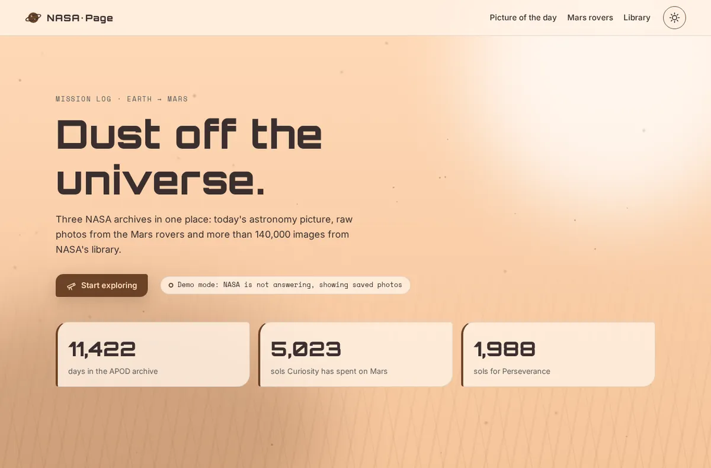
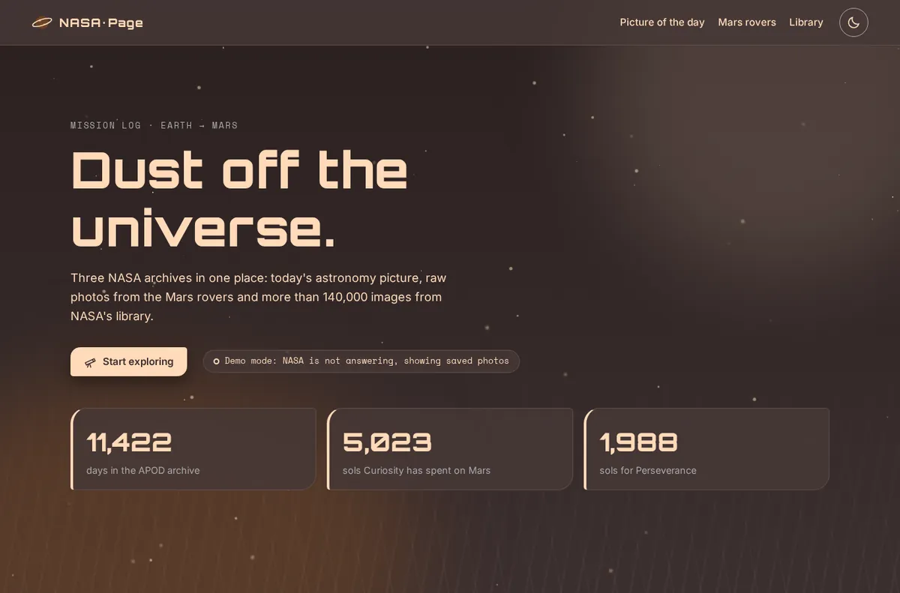
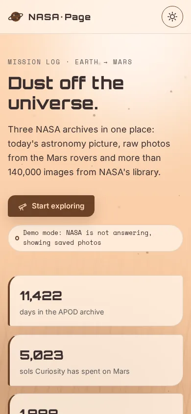

[English](README.md) · **Lietuvių**

# NASA Page

Marso stiliaus kosmoso naršyklė. Joje matysi NASA dienos astronomijos nuotrauką, Marso marsaeigių nuotraukas ir vaizdus iš NASA bibliotekos. Visa tai rodoma ant gyvo „dulkių audros“ fono.

**[Gyva demo versija](https://brutall100.github.io/nasa-page/)** · **[Kodas](https://github.com/brutall100/nasa-page)**



| Tamsus režimas | Telefonas (390px) |
|---|---|
|  |  |

## Apie projektą

NASA nemokamai dalijasi daugybe duomenų per viešus API. Šis puslapis sujungia tris iš jų į vieną vietą. Jo dizainą įkvėpė Marso paviršius: rūdžių rudumas, persikinės dulkės ir pilkos uolos. Tamsiame režime ant Marso stoja naktis, o virš dulkių sužiba žvaigždės.

Kartais NASA neatsako: nėra interneto, baigėsi užklausų limitas arba API išjungtas. Tada puslapis įsijungia **demo režimu** ir rodo išsaugotas nuotraukas. Todėl jis niekada neatrodo „sulūžęs“.

## Galimybės

- **Dienos astronomijos nuotrauka (APOD).** Gali pasirinkti bet kurią dieną nuo 1995 m. birželio 16 d. arba atsitiktinę dieną. Veikia ir vaizdo įrašai.
- **Marso marsaeigių nuotraukos.** Pasirink Curiosity, Perseverance, Opportunity arba Spirit ir solą (Marso dieną). Jei solo nenurodysi, gausi siurprizą. Jei Marso nuotraukų API neveikia, puslapis suranda to marsaeigio nuotrauką NASA bibliotekoje.
- **NASA bibliotekos paieška.** Įrašyk bet kokį žodį ir gausi atsitiktinę tinkamą nuotrauką su nuoroda į šaltinį.
- **Gyvas fonas.** Dulkių dalelės plaukia Marso vėju, švytėjimai lėtai juda, o tamsiame režime mirga žvaigždės. Telefone dalelių mažiau, o jei nori mažiau judėjimo, jos išsijungia.
- **Misijos skaičiai** suskaičiuoja, kai prie jų nuslenki: kiek dienų yra APOD archyve ir kiek solų kiekvienas marsaeigis praleido Marse (skaičiuojama gyvai).
- **Šviesus ir tamsus režimai.** Puslapis seka tavo sistemos nustatymą. Yra perjungimo mygtukas, kuris įsimena pasirinkimą, o kraunantis puslapis nesumirga.
- **Mygtukai su mikro efektais.** Jie pakyla, nusileidžia, skleidžia bangelę, o kiekvienas turi savo ikonos animaciją: besisukantį marsaeigio ratą, pakylančią raketą, besiverčiantį kauliuką.
- **Prieinamumas.** Yra „Skip to content“ nuoroda, matomas fokusas, etiketės kiekvienam laukeliui, alt tekstai ir WCAG AA kontrastas.

## Naudotos technologijos

- HTML, CSS ir paprastas JavaScript (be karkasų, be kompiliavimo)
- [NASA Open APIs](https://api.nasa.gov/): APOD ir Mars Rover Photos, taip pat [NASA Image and Video Library](https://images.nasa.gov/)
- Google Fonts: **Orbitron** (antraštės), **Inter** (tekstas), **Space Mono** (skaičiai ir užrašai)

**Spalvų paletė** (visos spalvos yra `:root` bloke, `css/style.css` failo viršuje)

| Spalva | Hex | Kur naudojama |
|---|---|---|
| Kakava | `#3b2f2f` | Tamsus fonas, tekstas šviesiame režime |
| Kakava 2 | `#3c2f2f` | Laukeliai tamsiame režime |
| Persikinės dulkės | `#ffdab9` | Šviesus fonas, tekstas ir švytėjimas tamsiame režime |
| Rūdys | `#6b4226` | Mygtukai, akcentai, dulkių dalelės |
| Regolito pilka | `#a9a9a9` | Antraeilis tekstas tamsiame režime |

Papildomi atspalviai iš tos pačios paletės: `#fff1e4` (šviesios kortelės), `#463837` (tamsios kortelės), `#5c5c5c` (antraeilis tekstas šviesiame režime, nes `#a9a9a9` ant persikinės spalvos per blyški perskaityti).

## Ką išmokau

- Dirbti su keliais REST API naudojant `fetch`, `async/await`, laiko limitus ir klaidų valdymą
- Sukurti atsarginę grandinę: gyvas API → kitas API → išsaugoti demo duomenys
- Saugiai rodyti tekstą iš API su `textContent`, o ne `innerHTML`
- Kurti dizainą su CSS kintamaisiais, kad visą paletę būtų galima pakeisti vienoje vietoje
- Daryti šviesų ir tamsų režimus, kurie nesumirga kraunantis
- Animuoti tik `transform` ir `opacity`, kad puslapis veiktų sklandžiai
- Tikrinti spalvų kontrastą pagal WCAG ir gerbti `prefers-reduced-motion`

## Kaip paleisti savo kompiuteryje

Nieko diegti nereikia. Puslapis sukurtas tik iš HTML, CSS ir JS.

```bash
git clone https://github.com/brutall100/nasa-page.git
cd nasa-page
python3 -m http.server 8000
# atidaryk http://localhost:8000
```

Taip pat gali tiesiog atidaryti `index.html` naršyklėje.

**API raktas:** projektas naudoja viešą NASA raktą `DEMO_KEY` (apie 30 užklausų per valandą). Jei reikia daugiau, susikurk nemokamą raktą [api.nasa.gov](https://api.nasa.gov/) ir įrašyk jį į `NASA_API_KEY`, `js/app.js` failo viršuje. Šis puslapis veikia tik naršyklėje, todėl bet kokį ten įrašytą raktą matys ir lankytojai. Ten rašyk tik nemokamą NASA raktą, niekada ne slaptą.

## Projekto struktūra

```
nasa-page/
├── index.html          puslapio HTML
├── favicon.svg         ikona projekto spalvomis
├── css/
│   └── style.css       paletė, išdėstymas, animacijos
├── js/
│   ├── theme-init.js   pritaiko išsaugotą temą dar prieš nupiešiant puslapį
│   ├── background.js   gyvas „dulkių audros“ fonas
│   ├── ui.js           temos perjungimas, bangelė, atsiradimas slenkant, skaičiavimas
│   └── app.js          NASA API ir demo režimas
├── images/             atsarginės nuotraukos (WebP)
├── docs/               ekrano nuotraukos šiam README
├── LICENSE
└── README.md / README.lt.md
```

## Padėkos

- Duomenys ir nuotraukos: [NASA Open APIs](https://api.nasa.gov/) ir [NASA Image and Video Library](https://images.nasa.gov/). NASA turinys dažniausiai nesaugomas autorių teisių. APOD nuotraukos gali priklausyti prie jų nurodytam fotografui.
- Atsarginės nuotraukos `images/` aplanke yra NASA kosmoso vaizdai.
- Šriftai: [Orbitron](https://fonts.google.com/specimen/Orbitron), [Inter](https://fonts.google.com/specimen/Inter) ir [Space Mono](https://fonts.google.com/specimen/Space+Mono) iš Google Fonts (SIL Open Font License).
- Tai gerbėjo projektas, nesusijęs su NASA ir jos nepatvirtintas.

## Licencija

[MIT](LICENSE) © 2026 brutall100
